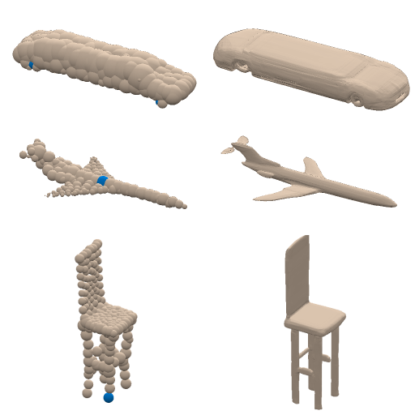
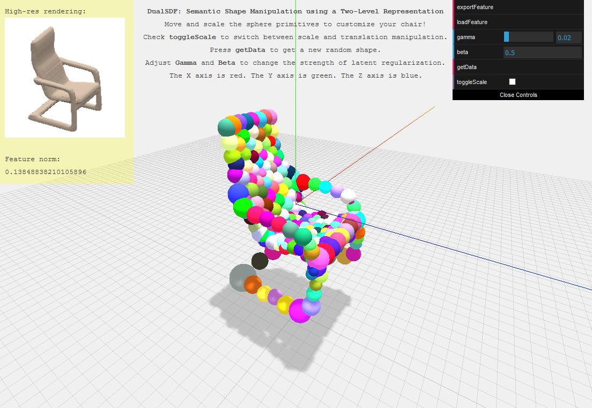

# DualSDF

This repo contains an implementation of the CVPR 2020 paper:  

**DualSDF: Semantic Shape Manipulation using a Two-Level Representation**,  
by **Zekun Hao**, **Hadar Averbuch-Elor**, **Noah Snavely**, **Serge Belongie**.  

[[Paper]](https://arxiv.org/pdf/2004.02869.pdf)
[[Website]](http://www.cs.cornell.edu/~hadarelor/dualsdf/)

<table>
    <tbody>
        <tr>
            <td>Adjust the wheelbase of the car by changing the distance between the two selected spheres</td>
            <td rowspan=3>
                <p align="center">
                    
                </p>
            </td>
        </tr>
        <tr>
            <td>Adjust the fuselage diameter of the airplane by changing the diameter of the selected sphere</td>
        </tr>
        <tr>
            <td>Adjust the height of the chair by moving the selected sphere located on one of the legs</td>
        </tr>
    </tbody>
</table>


## Live demo
[[Demo-Chair]](http://35.202.137.6:8080/) [[Demo-Airplane]](http://35.202.137.6:8081/)

[](http://35.202.137.6:8080/)  

The WebGL demo is largely based on [three.js examples](https://threejs.org/examples/).

## Citing DualSDF

If you find our code useful, please consider citing our paper:

```
@inproceedings{hao2020dualsdf,
  title={DualSDF: Semantic Shape Manipulation using a Two-Level Representation},
  author={Hao, Zekun and Averbuch-Elor, Hadar and Snavely, Noah and Belongie, Serge},
  booktitle={Proceedings of the IEEE/CVF Conference on Computer Vision and Pattern Recognition},
  year={2020}
}
```

## Running the live demo locally
We provide pretrained models for the chair and airplane categories. Each model is trained on a subset of shapes from the corresponding [ShapeNet](https://www.shapenet.org/) category. The list of shapes can be found under `datasets/splits`, which are taken from [DeepSDF](https://github.com/facebookresearch/DeepSDF).

```bash
# Host the chair demo on port 1234 (default port) using GPU 0
python3.6 demo.py ./config/dualsdf_chairs_demo.yaml --pretrained ./pretrained/dualsdf_chairs_demo/epoch_2799.pth

# Host the airplane demo on port 4321 using GPU 1
CUDA_VISIBLE_DEVICES=1 python3.6 demo.py ./config/dualsdf_airplanes_demo.yaml --pretrained ./pretrained/dualsdf_airplanes_demo/epoch_2799.pth --port 4321

# Visit localhost:1234 or localhost:4321 on a browser that supports WebGL.
# We have tested Firefox and Chrome.
```

## Training DualSDF from scratch

### Download pre-sampled SDF dataset

We provide pre-sampled SDF dataset for ShapeNet chairs and airplanes on [Google Drive](https://drive.google.com/drive/folders/14ZCfbQCSItmw6M_3EgbguUOy9kpkZQNU?usp=sharing). They are in SquashFS format so that you can mount it directly in Linux without extraction.

To mount a SquashFS file with `squashfuse`:
```bash
squashfuse <path_to_sqfs_file> <path_to_mount_point>
```

Alternatively, with `mount`:
```bash
mount <path_to_sqfs_file> <path_to_mount_point> -t squashfs -o loop
```

Alternatively, extract a SquashFS file:
```bash
unsquashfs -f -d <destination_path> <path_to_sqfs_file>
```

#### Dataset overview
Our SDF dataset contains SDF samples from all the shapes in the ShapeNetCore v2 chair and airplane categories. Each shape is normalized to be within a unit sphere prior to sampling.

There are two directories for each shape category:
- `<category_id>_sphere` contains sdf values sampled uniformly within the unit sphere. There are 250000 samples for each shape.
- `<category_id>_surface` contains sdf values sampled near the surface. There are at least 500000 samples for each shape. The first half of them are inside the shape (negative sign) while the second half of them are outside (positive sign).

SDF samples are stored as N-by-4 numpy arrays and saved as individual npy files `<shape_id>.npy`. N samples are given and each sample takes the form of (x, y, z, d).


### (Optional) Sample SDF yourself using the provided code

Use the following instructions if you want to sample your own SDF dataset.

#### Download ShapeNetCore v2 dataset

[ShapeNet website](https://www.shapenet.org/)

#### Convert ShapeNet meshes to numpy npy files

For ease of process, we convert meshes to numpy arrays before sampling SDFs.

[Tools](https://www.shapenet.org/tools) are widely available to load ShapeNet obj files. Each npy file should contain a float32 array with a shape of `#triangles x 3 (vertices) x 3 (xyz coordinate of each vertex)`, representing a triangle mesh. The scale and center of the mesh is not important, as it will be normalized to a unit sphere right before sampling SDFs.

The naming convention is as follows:
```
<category_id>/
    <shape_id>.npy
```
Other shape datasets (i.e. [ABC Dataset](https://deep-geometry.github.io/abc-dataset/), [ModelNet](https://modelnet.cs.princeton.edu/), [PartNet](https://cs.stanford.edu/~kaichun/partnet/)) can be used instead of ShapeNet, as long as they are also converted to npy format and the npy files are stored using the naming convention described above.

#### Sample signed distance fields from meshes

Compile the CUDA kernel for computing SDF:  
```bash
cd extensions/mesh2sdf2_cuda
make
```

Sample SDFs using the provided script:
```bash
python3.6 sample_sdfs.py <path_to_mesh_npy_folder> <path_to_save_sampled_results>
```
This is what the result directory should look like:
```
<path_to_save_sampled_results>/
    <category_id>_sphere/
        <shape_id>.npy
    <category_id>_surface/
        <shape_id>.npy
```

### Training
#### Creating a config file
It is a good idea to start with an existing config file (i.e. `config/dualsdf_airplanes_demo.yaml`). Edit the `data` section to reflex your dataset configuration. You will need to build and specify your own `split_files` for new datasets. It is generally a good idea to exclude shapes with large non-manifold regions, as they cannot be represented well with SDFs.
```
data:
    ...
    cate_id: "02691156" # Replace with your category id
    split_files:
        train: ./datasets/splits/sv2_planes_all.json # Replace with your training split file
        test: ./datasets/splits/sv2_planes_all.json # Replace with your testing split file
    sdf_data_dir:
        surface: /mnt/data3/ShapeNet_sdf_even/02691156_surface # Replace with your path
        sphere: /mnt/data3/ShapeNet_sdf_even/02691156_sphere # Replace with your path
    ...
...
```
#### Run training
```bash
python3.6 train.py ./config/dualsdf_airplanes_demo.yaml
```
Tensorboard databases and checkpoints will appear under `logs` directory.

#### Rendering SDFs
To render shape reconstruction results on the training set, run the following command with properly set paths to config file and checkpoint file:
```bash
python3.6 train.py ./config/dualsdf_airplanes_demo.yaml --resume --pretrained ./pretrained/dualsdf_airplanes_demo/epoch_2799.pth --special render_known_shapes
```
The rendered images of both primitive-based representation and high-resolution representation will appear under the `logs/special_render_known_shapes_dualsdf_airplanes_demo_<datetime>` directory.   
A comprehensive set of options related to rendering, such as resolution, color scheme, etc. can be modified in the config file.

## Requirements
The code was developed under Python 3.6 and Pytorch 1.4. Other dependencies are:
 - `opencv-python` (Only for running the demo)
 - `tensorboardX` (Only for training)

## Licence
MIT License
